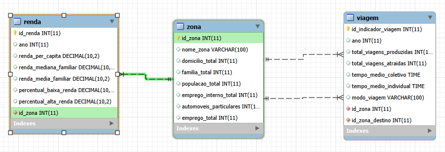

## Desigualdade Social no Transporte Urbano
Projeto de Banco de Dados desenvolvido em SQL com o objetivo de analisar como a desigualdade social influencia os deslocamentos urbanos na Região Metropolitana de São Paulo, utilizando dados da [Pesquisa Origem e Destino 2023 do Metro SP](https://www.metro.sp.gov.br/pt_BR/pesquisa-od/).

## Sobre o Projeto
O acesso ao transporte é um dos principais fatores que impactam a qualidade de vida da população. Este projeto utiliza conceitos de modelagem de banco de dados, permitindo identificar padrões relacionados à mobilidade urbana, renda, tempo de deslocamento e características socioeconômicas da população. Além da implementação do banco de dados, o projeto demonstra como consultas SQL podem transformar dados em informações relevantes para apoiar estudos sobre mobilidade e desigualdade social.

## Objetivos
- Modelar um banco de dados.
- Construir um banco de dados relacional.  
- Produzir informações que auxiliem na compreensão da desigualdade social no transporte urbano.  

## Base de Dados
Os dados utilizados neste projeto são baseados na [Pesquisa Origem e Destino 2023 do Metro SP](https://www.metro.sp.gov.br/pt_BR/pesquisa-od/).
As informações contemplam, entre outros aspectos:  
- Local de origem e destino das viagens;  
- Tempo de deslocamento;  
- Meio de transporte utilizado;  
- Características socioeconômicas;  
- Faixa de renda;  
- Motivo da viagem;  
- Distrito e município.  

## Modelagem do Banco
O banco foi desenvolvido utilizando o modelo relacional. Etapas do desenvolvimento:  
- Coleta de dados - [Pesquisa Origem e Destino 2023 do Metro SP](https://www.metro.sp.gov.br/pt_BR/pesquisa-od/). 
- Modelo Conceitual  
- Modelo Lógico  
- Modelo Físico  
- Criação das tabelas  
- Inserção dos dados  
- Consultas SQL    

## Tecnologias Utilizadas  
- SQL  
- MySQL  
- MySQL Workbench   
- GitHub  

## Consultas Desenvolvidas
O projeto contempla consultas voltadas para análises como:  
- Tempo médio de deslocamento por faixa de renda;  
- Comparação entre diferentes meios de transporte;  
- Distribuição das viagens por distrito;  
- Relação entre renda e tempo de deslocamento;  
- Indicadores de desigualdade na mobilidade urbana.  

## Resultados Esperados  
Com as consultas implementadas é possível:  
- Identificar regiões com maiores tempos de deslocamento;  
- Comparar padrões de mobilidade entre diferentes grupos sociais;  
- Apoiar estudos sobre planejamento urbano;  
- Demonstrar a aplicação prática de SQL em problemas reais.  

## Modelo Entidade-Relacionamento

 
## Equipe    
- [Bariany](https://github.com/Bariany) 
- [gaby001100](https://github.com/gaby001100)
- [felipe](link).

## Referências
- [Pesquisa Origem e Destino 2023 do Metro SP](https://www.metro.sp.gov.br/pt_BR/pesquisa-od/)
- [Documentação oficial do MySQL Workbench](https://dev.mysql.com/doc/workbench/en/).  

## Licença  
Este projeto foi desenvolvido para fins acadêmicos e educacionais.  
 
